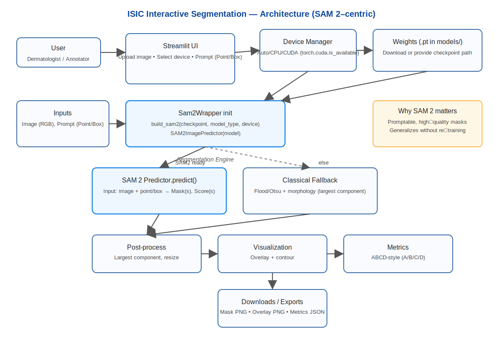

# ISIC Interactive Segmentation Demo (SAM 2)

This repo contains a Streamlit app that demonstrates interactive skin lesion segmentation on ISIC images using the SAM 2 model. You can prompt the model with a point or a bounding box, see a live overlay, compute ABCD-style metrics, and export the results.

Note: This demo is for research/educational purposes only and is NOT a medical device or diagnostic tool.

## Features
- Upload your own dermoscopy image or pick from a local samples folder
- Prompt options: single point or bounding box
- Device selection: CPU or CUDA (with Auto-detect). If CUDA is not available, it automatically falls back to CPU
- Visual overlays: transparent mask and contour
- ABCD-style metrics: area, equivalent diameter, circularity, border irregularity, asymmetry, and simple color variegation
- Export: mask (PNG), overlay (PNG), and metrics (JSON)

## Quickstart

### 1) Python environment
- Python 3.10 or newer is recommended
- Windows (tested), should also work on Linux/macOS with minor changes

Create and activate a virtual environment (PowerShell):

```
python -m venv .venv
. .venv\Scripts\Activate.ps1
python -m pip install --upgrade pip
```

### 2) Install dependencies
By default, requirements.txt installs CPU-compatible packages. You can later switch to a CUDA build of PyTorch if you have a compatible GPU.

```
pip install -r requirements.txt
```

Optional: Install a CUDA build of PyTorch (choose the correct CUDA version for your system; example for CUDA 12.1):

```
pip install --upgrade torch torchvision --index-url https://download.pytorch.org/whl/cu121
```

Confirm CUDA is available:

```
python -c "import torch; print('CUDA available:', torch.cuda.is_available())"
```

### 3) Install SAM 2 (if not installed via requirements)
If SAM 2 didn’t install from requirements, install directly from GitHub:

```
pip install git+https://github.com/facebookresearch/segment-anything-2.git
```

### 4) Download model weights
Download a SAM 2 checkpoint (e.g., `sam2_hiera_large.pt`) and place it under `models/`. The app also includes a button to download the weights at runtime.

- Official repo: https://github.com/facebookresearch/segment-anything-2
- Example filename: `models/sam2_hiera_large.pt`

### 5) Add sample images
Place a few ISIC dermoscopy JPEG/PNG files under:

```
./data/samples/
```

You can download public samples from the ISIC Archive: https://www.isic-archive.com/

### 6) Run the app

```
streamlit run app.py
```

Open the URL shown in the terminal (typically http://localhost:8501).

## Usage
- Select Device on the left (Auto/CPU/CUDA)
- Provide the checkpoint path (e.g., `models/sam2_hiera_large.pt`)
- Upload an image or choose a sample
- Pick a Prompt mode (Point or Box) and draw on the canvas
- Click “Run Segmentation” to see results, metrics, and export options

If CUDA is selected but not available, the app will warn and fall back to CPU.

## Architecture

The diagram below shows the main components and how SAM 2 fits into the pipeline. The Streamlit UI collects the image and prompt, the Sam2Wrapper initializes the model with your selected device (CPU/CUDA) and weights, and the segmentation output drives visualization and ABCD-style metrics. A classical fallback keeps the app usable if SAM 2 or weights are unavailable.



SAM 2 relevance:
- Promptable segmentation for fast clinician-in-the-loop masks
- Strong generalization without re-training
- High-quality borders enabling more stable ABCD metrics

## Notes and Troubleshooting
- If SAM 2 import fails: ensure it’s installed (`pip show sam2` may not work if installed directly from GitHub; try `pip freeze | findstr sam2`) and that dependencies resolved.
- On Windows, long paths and special OneDrive permissions can sometimes cause install issues. If so, try a local non-synced folder.
- For GPU: make sure you installed a CUDA-enabled PyTorch build matching your installed NVIDIA drivers.

## Docker

You can run the app in a container. Two options are provided:

1) CPU image (portable anywhere)

Build (from repo root):

PowerShell (Windows):
```
docker build -t isic-sam2-demo:cpu .
```

Linux/macOS:
```
docker build -t isic-sam2-demo:cpu .
```

Run (mount local models/ and data/samples/ so the container can see them):

PowerShell (Windows):
```
docker run --rm -p 8501:8501 ^
  -v "$PWD/models:/app/models" ^
  -v "$PWD/data/samples:/app/data/samples" ^
  --name isic-sam2-demo isic-sam2-demo:cpu
```

Linux/macOS:
```
docker run --rm -p 8501:8501 \
  -v "$(pwd)/models:/app/models" \
  -v "$(pwd)/data/samples:/app/data/samples" \
  --name isic-sam2-demo isic-sam2-demo:cpu
```

Then open http://localhost:8501

2) GPU image (optional; requires NVIDIA GPU + drivers + nvidia-container-toolkit)

We also provide a `Dockerfile.gpu` that leverages a CUDA-enabled PyTorch base image. Build and run with the NVIDIA runtime:

Build:
```
docker build -f Dockerfile.gpu -t isic-sam2-demo:gpu .
```

Run (Windows PowerShell with NVIDIA runtime):
```
docker run --rm -p 8501:8501 ^
  --gpus all ^
  -v "$PWD/models:/app/models" ^
  -v "$PWD/data/samples:/app/data/samples" ^
  --name isic-sam2-demo-gpu isic-sam2-demo:gpu
```

Linux/macOS:
```
docker run --rm -p 8501:8501 \
  --gpus all \
  -v "$(pwd)/models:/app/models" \
  -v "$(pwd)/data/samples:/app/data/samples" \
  --name isic-sam2-demo-gpu isic-sam2-demo:gpu
```

Note: GPU container runs are only beneficial if you have a compatible NVIDIA GPU and drivers installed. Otherwise, use the CPU image.

## Disclaimer
This software is provided “as is” for demonstration only. It is NOT intended for clinical use or to provide medical advice.
